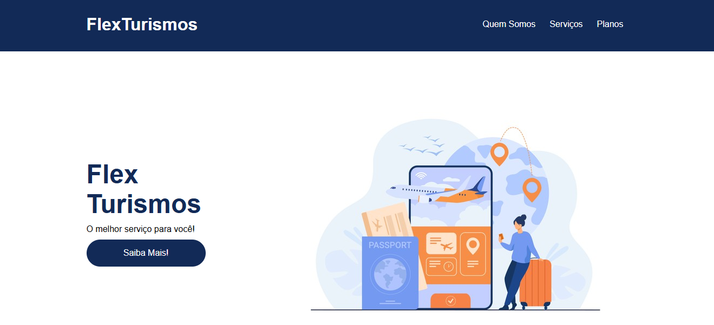

<!DOCTYPE html>
<html lang="pt-BR">
<head>
    <meta charset="UTF-8">
    <meta name="viewport" content="width=device-width, initial-scale=1.0">
    </head>
<body>
    

        <h1 style="color: #0056b3; text-align: center;">🌍 Projeto Landing Page - Empresa de Turismo 🏖️</h1>
        

            

        

            Este projeto foi desenvolvido como parte das aulas da <strong>DIO</strong>, com o objetivo de criar uma landing page para uma empresa de turismo. ✈️🌴
              
            A página foi construída utilizando as linguagens <strong>HTML</strong> e <strong>CSS</strong>, visando um design atraente, funcional e responsivo, adequado para promover serviços turísticos e atrair clientes. 🧳✨

        

            Durante o desenvolvimento, foram aplicados conceitos de estruturação de páginas, estilização e boas práticas no uso de HTML e CSS, com foco em flexbox e na responsividade do site, fortalecendo o aprendizado e a prática em desenvolvimento web. 🚀💻

    

</body>
</html>
